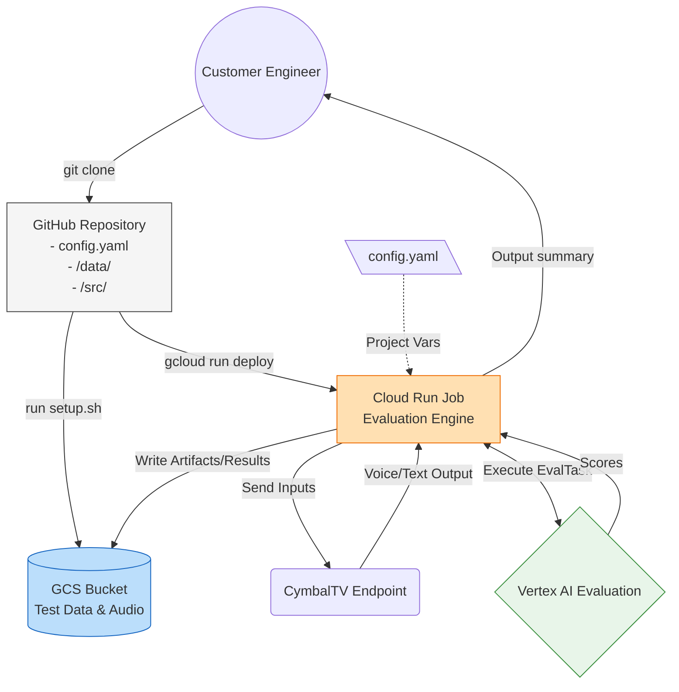

# Architecture Flowchart

Below is the solution design flowchart demonstrating how the evaluation framework operates. Customer Engineers can reference this to understand the data lifecycle from local repository to Google Cloud.

